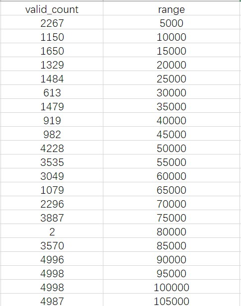
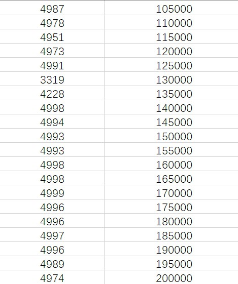
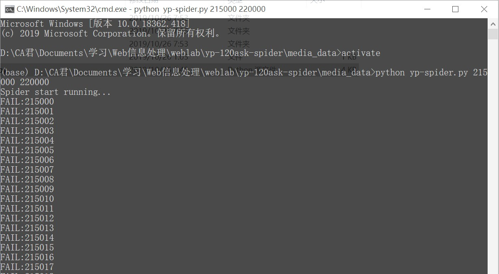
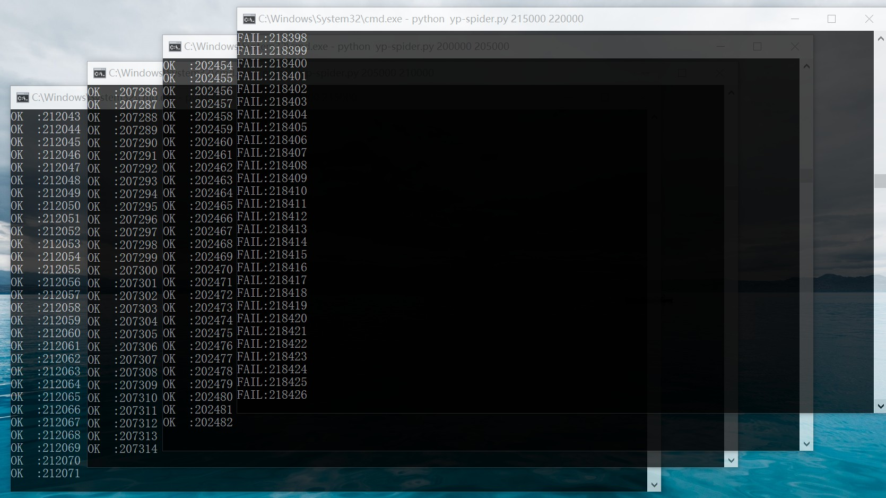
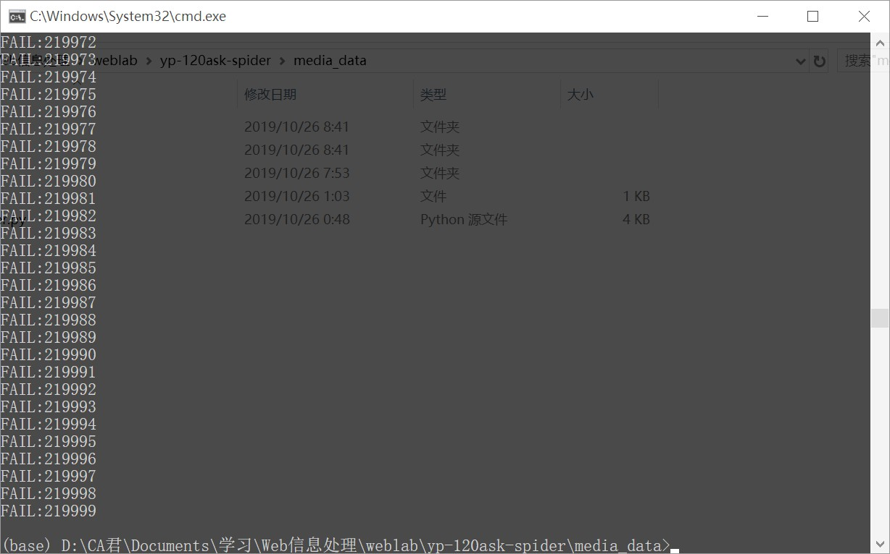

# yp-120ask-spider

## 简介

这是一个采集 [快速问医生](http://120ask.com) 网站中 [药品库](https://yp.120ask.com) 信息的爬虫。

为 2019 Web信息处理 课程开放实验项目之一。

设计过程写在了[后面](#设计过程)，供参考。

文件说明：

+   main.py: 爬虫主程序
+   yp-spider-batch.py: 适用于多进程的爬虫程序
+   sh: 后台多任务，完整运行对整个网站爬取的脚本
+   data.rar: 药品库所有数据 (.json 格式)
+   index.rar: 有效的 id (.json 格式)
+   statistics.xlsx: 对爬取数据的统计信息

**注**：使用 `yp-spider-batch.py` 方法

`> python yp-spider-batch.py {begin} {end}`

{begin} 整数，id 起始值

{end} 整数，id 终止值

## 相关信息

+   Author: Censyu
+   Start Date: 2019/10/25
+   Deadline: 2019/11/9
+   Latest Update: 2019/10/26

## 实验要求

:arrow_right: [原地址](https://git.bdaa.pro/yxonic/data-specification/wikis/快速问医生%20药品)

###  网站描述

[快速问医生](http://tag.120ask.com)是一个医疗信息百科网站，主要有疾病、症状、检查、手术、药品五类信息。通过网站右上角的资料卡片，可以进入每类信息的专题页面。本实验的目标是采集[药品库](http://yp.120ask.com/)的数据。 

###  药品需求 

可直接利用网址构成遍历

http://yp.120ask.com/detail/ + 数字 +.html

对于某个药品的页面，我们需要以下信息：

药品名称、参考价、相关疾病、药品详情、药品说明书

###  药品数据格式

```json
[
    {
        类型: "药品",
        网址: "http://xxx..."
        名称: "xx",
        参考价: "",
        相关疾病: [
        	{名称: "aaa", 网址: ""},
        	{名称: "bbb", 网址: ""},
        	...
        ],
		药品详情: {
            商品名称: "",
            ...
            生产企业: ""
        },
        药品说明书: {
            商品名称: "",
            ...
            贮藏: ""
        }
    }
]
```

###  评分标准 

+   采集到100个页面的全部域：1分

+   采集到网站全部页面：2分

## 设计过程

### 网站分析

在药品库页面显示了该网站共有 154219 种药品（till 19/10/25）。

并且搜索页面提供了 20*100 共 2000 个药品详情的链接，这远小于所有药品数，因此需要遍历以获取全部内容。此外注意到最后一页最后一个药品的 id 为 5375，显然 id 并不是连续的，中间存在大量空隙。

### 数据分析

查看网页源码，找到所需信息位置，并写出相应的 CSS 选择器（使用 BeautifulSoup4 进行解析）：

```python
selector_name = '.details-right-drug p'  # [0]
selector_price = '.Drugs-Price span'  # [0]
selector_diseases = '.details-right-drug ul li var'
selector_details_key = '.cont-Drug-details .tab-dm-1 .table .td'
selector_details_val = '.cont-Drug-details .tab-dm-1 .table .td-details'
selector_instructions_key = '.cont-Drug-details .tab-dm-2 .table .td'
selector_instructions_val = '.cont-Drug-details .tab-dm-2 .table .td-details'
```

其中名称和参考价直接获取文本即可。相关疾病、药品详情和说明书有子结构，需要进一步解析，见代码中函数 `getDiseases()` `getDetails()`

对于相关疾病：

疾病名在 `var` 标签的 onclick 属性中函数调用参数里，直接用正则表达式提取即可

` tagSearch() ` 函数，查看该元素的 onclick 事件可以找到这个函数的实现：

```js
// 疾病词
function tagSearch(kw){
    window.open("//yp.120ask.com/search?kw="+kw);
}
```

从而找到疾病跳转网址（但事实上这段代码写错了...应该在 `?` 前加一个 `/`）

### 反爬机制

这个网站的反爬机制很简单，只用设置 User-Agent 即可直接获取内容

### 程序架构

使用 python 语言，使用 requests 获取原始数据、BeautifulSoup4 进行页面解析、re 用于提取关键词、json 存为 .json 格式文件

### 数据获取

为了防止意外的错误，从 0 开始遍历 id ，并以每 5000 个为一组，单独存在一个文件中，文件路径 `/data/drugs_data{N}.json` ，同时记录有效 id ，以便再次爬取时不用全部遍历，文件路径 `/index/calid_id_{valid_count}_in_{N}`

参数说明：

+   N: 当前分组的上界（5000 * i, i from 1 to 44，总 id 范围为 0~219999）
+   valid_count: 当前分组中有效 id 个数

然后创建适用于多进程的 python 程序（`yp-spider-batch.py`），即接受两个从命令行传入的参数，用于决定 id 遍历范围

首先尝试前 200000 个 id，在 10/25 夜借用同学电脑运行（在此感谢 gp 同学！！），见下图统计信息：





可以看到在 80000 之后 id 分布相当密集，此时已经有 14万左右的有效数据了

继续向后运行，此前人工尝试时已经发现在 220000 后几乎就没有数据了，因此再开四个分组：

发现在 215000-220000 区间貌似没有有效数据



运行看看：



最后一个分组运行到最后也没有一个成功的：



将新的数据追加到数据集，最终得到 158875 个有效数据，略大于网站给出的 154219 种。数据大小 760MB 压缩后 31.1MB